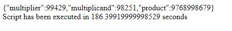

# Test task for Intetics

### Specification
Напишите программу, которая возвращает наибольшее число палиндром, которое является произведением двух простых пятизначных чисел, а также возвращает сами сомножители.
Простое число - это натуральное число, которое делится нацело только на 1 и на себя само (2, 3, 5, 7, 11, …)
Палиндром – строка, которая читается одинаково в обоих направлениях (например ABBA)

### Run program
To launch the program you have to download this repository and simply run *index.html* in you browser. Results of calculations can be viewed in opened window.

